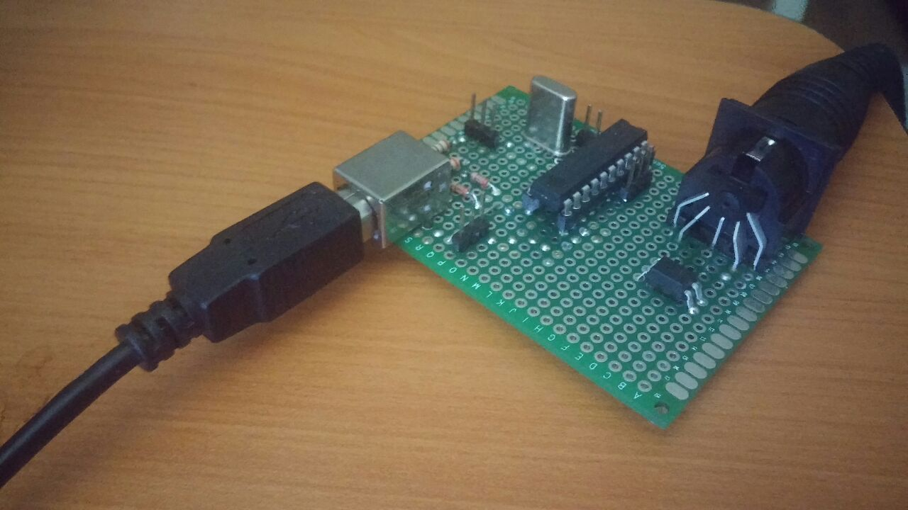

##Attiny2313-USB-MIDI

Modified version of the "USB-MIDI Converter もこ" project by <https://twitter.com/morecat_lab>. 

Original project details can be found from: <http://morecatlab.akiba.coocan.jp/morecat_lab/MOCO-e.html>

My modifications can be found below:
	
* Opitimised MIDI decoding algorithm. Original firmware were missing notes when played in chord shapes and somewhat fast manner. I wrote a simpler, interrupt based MIDI decoder. My version of the decoder only handles *Note On* and *Note Off* events. It also support running status.
	
* Made the firmware compatible with the avr-gcc 4.8.1 by changing PROGMEM variables to const PROGMEM variables.

